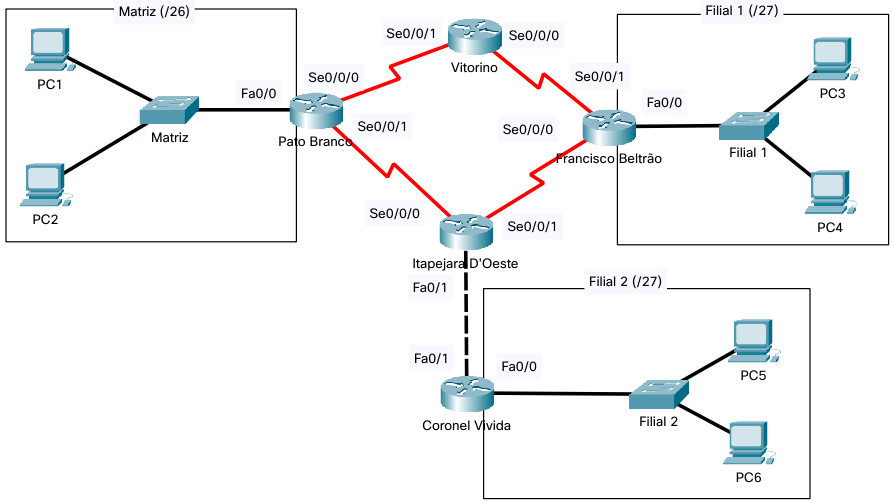

## Disciplina Redes de Computadores 1 - Engenharia de Computação/Elétrica - UTFPR - 2022/1


# Trabalho 2 - Integração de Habilidades


## Objetivo
Este trabalho prático compreende a criação de uma topologia de rede simulando uma situação real.  Ao final da execução desta avaliação, você estará demonstrando a sua capacidade de criar diferentes cenários de rede, assim como o trabalho em equipe. Com a conclusão desta atividade, você será capaz de demonstrar que obteve as seguintes habilidades:
* Projetar a rede lógica;
* Configurar a topologia física e lógica;
* Definir as rotas estáticas para redes remotas;
* Fazer a documentação da rede;
* Configurar switches, roteadores e dispositivos finais de modo a permitir a comunicação entre todos;
* Verificar a conectividade entre os dispositivos usando protocolo IPv4 e IPv6;
* Definir propriedades de segurança nos equipamentos;
* Trabalho em equipe.

## Topologia
Neste trabalho, você criará uma pequena topologia para interligação da Matriz de uma empresa localizada em Pato Branco e suas Filiais localizadas em Francisco Beltrão e Coronel Vivida.  A topologia a ser utilizada está apresentada na [Figura 1](#figura1). 


**Figura 1 - Topologia**


## Tarefa 1: Projetar e documentar as sub-redes
Utilize o bloco de endereço IPv4 200.200.**N**.0/24 e IPv6 2001:DB8:ACAD:**NN**00::/56 para criar sub-redes de forma a atender os prefixos especificados na topologia, as demais especificações devem atender as seguintes demandas:
* O número N e NN equivalem aos dois últimos números do seu RA, sendo que NN deve ser convertido para hexadecimal. Ex: se o seu número for **1**1, ficaria 200.200.**11**.0/24 e 2001:0DB8:ACAD:**0B**00::/56.
* O prefixo IPv4 para a LAN da Matriz deve ser **/26** e para a Filial 1 deve ser **/27**;
    * Deve-se prever a expansão da empresa com três novas filiais (Filial 2, Filial 3, Filial 4), todas com o prefixo **/27**.
* O prefixo IPv6 para as LANs, tanto da Matriz como das Filiais, deve ser **/64**;
* O prefixo para as WANs deve ser **/30** (IPv4) e **/112** (IPv6);
* Utilize a **primeira** sub-rede para endereçar os dispositivos da LAN da Matriz;
* Utilize a **segunda** sub-rede para endereçar os dispositivos da LAN da Filial 1;
* Utilize a **terceira** sub-rede para endereçar os dispositivos da LAN da Filial 2;
* Reserve a **quarta** e **quinta** sub-redes para novas filiais da empresa; 
* No IPv4, utilize a **última sub-rede /27** disponível para criar sub-redes /30 para endereçar os enlaces entre os roteadores (pb-vit, vit-fb, fb-ita, ita-pb, ita-cv e as novas filiais);
* No IPv6, utilize a **última sub-rede /64** disponível para criar sub-redes /112 para endereçar os enlaces entre os roteadores (pb-vit, vit-fb, fb-ita, ita-pb, ita-cv e as novas filiais). Utilize o algoritmo Righmost (RFC 3531), para criar as sub-redes. Sugestão: usar o simulador disponível em [http://ipv6.br/paginas/old_subnet](http://ipv6.br/paginas/old_subnet).
* Documente as sub-redes conforme [modelo](trabalho2-documentacao-NomeAluno.md).
    * Sugere-se que você insira as informações de sub-rede também na topologia (PacketTracer), para ficar mais fácil a visualização.

## Tarefa 2: Documentar a configuração da rede lógica dos dispositivos
Os endereços IP das interfaces dos Hosts e Roteadores devem ser atribuídos da seguinte maneira:
* O PC1 usará o **terceiro** endereço de host válido da sub-rede da Matriz;
* O PC2 usará o **quarto** endereço de host válido da sub-rede da Matriz;
* O PC3 usará o **terceiro** endereço de host válido da sub-rede da Filial 1;
* O PC4 usará o **quarto** endereço de host válido da sub-rede da Filial 1;
* O PC5 usará o **terceiro** endereço de host válido da sub-rede da Filial 2;
* O PC6 usará o **quarto** endereço de host válido da sub-rede da Filial 2;
* Os switches usarão o **segundo** endereço de host válido da respectiva LAN;
* Atribuir à interface Fa0/0 do roteador Pato Branco o **primeiro** endereço de host válido da sub-rede da Matriz;
* Atribuir à interface Fa0/0 do roteador Francisco Beltrão o **primeiro** endereço de host válido da sub-rede  Filial 1;
* Atribuir à interface Fa0/0 do roteador Coronel Vivida o **primeiro** endereço de host válido da sub-rede  Filial 2;
* Atribuir  à interface Se0/0/0 de cada roteador o **primeiro** endereço de host válido da sub-rede de ligação entre os roteadores. 
    * Esta interface será o **DCE**, com clock rate de **56000**.
* Atribuir à interface Se0/0/1 de cada roteador o **segundo** endereço de host válido da sub-rede de ligação entre os roteadores.
* Atribuir à interface Fa0/1 do roteador Itapejara o **primeiro** endereço de host válido da sub-rede de ligação entre os roteadores.
* Atribuir à interface Fa0/1 do roteador Coronel Vivida o **segundo** endereço de host válido da sub-rede de ligação entre os roteadores.
* Para IPv6, também deve-se especificar os endereços de link-local para as conexões, sendo:
    * nos computadores deve-se usar **EUI-64** para atribuição do endereço de **link-local**.
    * as ligações (WAN) entre roteadores deve se usar **EUI-64** para atribuição do endereço de **link-local**;
    * as ligações entre o roteador e as LANs deve ser especificar manualmente os endereços usando o endereço **FE80::1**, isto é, todas as interfaces Fa0/0 terão o IPv6 de link-local igual **FE80::1**;
* Documente o endereçamento para os dispositivos conforme [modelo](trabalho2-documentacao-NomeAluno.md).


## Tarefa 3: Documentar as tabelas de roteamento
* Definir as rotas em todos os roteadores de forma que os computadores da Matriz atinjam os computadores das filiais no **sentido horário**, isto é, através da rota “Pato Branco --> Vitorino --> Francisco Beltrão” e sejam respondidos pelo caminho oposto “Francisco Beltrão --> Itapejara D’Oeste --> Pato Branco”. O fluxo de ida é feito através de Vitorino e as respostas através de Itapejara D’Oeste.
* Documentar as tabelas de roteamento para IPv4 e IPv6, conforme modelo [modelo](trabalho2-documentacao-NomeAluno.md).
    * Não é obrigatório documentar as redes diretamente conectadas.
    
## Tarefa 4: Configuração básica dos dispositivos no Packet Tracer
* **Criar a topologia no Packet Tracer**, conforme ilustrado na **Figura 1**. 
    * Deve ser usado *roteadores modelo 2811* (inserir uma interface WIC-2T no slot 0 para as conexões WAN) e *switches modelo 2960*, que são os equipamentos disponíveis no laboratório de redes;
    * Na área de trabalho de cada topologia deve ser informado o **RA + Nome do aluno**;
        * Sugere-se que seja inserido as informações de endereçamento na topologia (área de trabalho do Packet Tracer), para ficar mais fácil a visualização.  
* **Nomear** os dispositivos intermediários (roteadores e switches) no IOS, como:
	 * Roteador Pato Branco para r-pb-nnn
	 * Roteador Francisco Beltrão para r-fb-nnn
	 * Roteador Itapejara para r-ita-nnn
	 * Roteador Vitorino para r-vit-nnn
	 * Roteador Coronel Vivida para r-cv-nnn
	 * Switch Matriz para sw-matriz-nnn
	 * Switches Filial 1 e Filial 2, para sw-filial1-nnn e sw-filial2-nnn, respectivamente
      Obs: **nnn** refere-se às iniciais do seu nome, ex: **r-pb-ff** / **sw-matriz-ff** (Fábio Favarim).
* **Endereçar** todas as interfaces de rede dos computadores (IPv4/máscara, IPv6/prefixo e gateway), roteadores (IPv4/máscara, IPv6/prefixo), switches (IPv4 na SVI e gateway) de acordo com o que foi documentado no **Quadro 2**.
    * Lembre-se que a interface serial Se0/0/0 será o DCE e assim deve ser configurado o clock rate de 56000.
    * Basta executar o comando “clock rate 56000” na inferface Se0/0/0.
* **Inserir** uma descrição em cada interface dos roteadores, de acordo com a rede a qual está conectada (ex: Matriz, pb-vit, vit-fb);
* **Configurar** as rotas estáticas  de acordo com o que foi documentado nos **Quadros 3 a 6**.
	 * Lembre-se que somente é necessário definir as rotas estáticas para as redes distantes, pois as rotas para as redes diretamente conectadas, automaticamente são criadas pelo roteador;
* **Testar** a topologia;
    * Execute o **ping**, via linha de comando (*command prompt*), a partir do PC0 para todas as outras interfaces existentes na topologia (dispositivos finais e intermediários);
    * Lembre-se de testar para IPv4 e para IPv6.

## Tarefa 5: Configuração de medidas básicas de segurança
 * Implementar as medidas básicas de seguranças nos roteadores (nos switches é opcional)
	 * Exigir que as senhas tenham comprimento mínimo de 10 caracteres;
	 * Impedir tentativas de login por ataque de força bruta de modo a bloquear tentativas de login por 120 segundos se houver 3 tentativas de login com falha dentro de 60 segundos;
	 * Encerrar as conexões via console e VTY após 5 minutos de inatividade;
	 * Ativar o serviço de criptografia de senhas em texto simples;
	 * Proteger o acesso ao EXEC privilegiado com a senha secreta @dmin-nome, sendo nome, o seu primeiro nome.
	 * Proteger o acesso via console com a senha @Cons-nome;
	 * Configure um banner MOTD para informar sobre o acesso não autorizado, conforme exemplo:
```	
--------------------------------------------------------------------------
|                                                                        |
|                          Roteador Pato Branco                          |
|                                                                        |
|               ATENÇÃO Acesso Restrito a pessoas autorizadas!           |
|                                                                        |
|          Administrador: SEU NOME COMPLETO (email@seuemail.com)         |
|                                                                        |
--------------------------------------------------------------------------
```    

 * Permitir o acesso remoto (linhas VTY 0 15) ao dispositivo somente via SSH e com usuário local:
	 * usar nome.sobrenome.com.br como nome de domínio (ex: fabio.favarim.com.br);
	 * usar nome e ssh@Network1ng como nome e senha, respectivamente, sendo nome o seu  primeiro nome;
	 * O tamanho da chave deve ser 1024.
	 
**Observação:** Todas as configurações nos roteadores devem ser feitas via CLI;

## Avaliação
* As Tarefas 1 a 5 é individual, porém, poderá ser feita em grupo! 
	 * No entanto, cada aluno deve fazer a sua atividade e ter total domínio do que foi feito.
* Entrega 1 - Disponibilizar, no moodle link para repositorio git (gitlab ou github ou outro repositório), 
    * Disponibilizar no repositório arquivo  .md contendo:
    * RA e Nome do aluno;
	* Documentação correspondente as Tarefas 1, 2 e 3;
        * Outras informações que achar relevante;
    * Data da entrega: até *31/05/2022* às 18h40min - **Prorrogado para 02/06/2022 às 15h50min**;
        * Não será aceita entrega após o prazo;
        * Obs: no dia 31/05/2022 (nova data - **02/06/2022**) às 18h40min será disponibilizado o gabarito para conferência e ajustes caso necessário;
* Entrega 2 – Disponibilizar no repositório criado:
	 * arquivo em formato .pkt (Packet Tracer), nomeado como trabalho2-topologia-NomeAluno.pkt com a topologia configurada e funcionando no Packet Tracer (Tarefas 4 e 5).
	 	 * Data da entrega: até *02/06/2022* às 8h20min (prorrogado para **07/06/2022**);
	 * Atualizar documentação (Entrega 1), corrigida, se for o caso;
	 * arquivos contendo a configuração de cada dispositivo intermediário da topologia (roteadores e switches)
	    * o nome de cada arquivo deve ser o mesmo nome do dispositivo definido na Tarefa 4, acrescido da extensão .txt (ex: r-pb-ff.txt)
            
          
## Critérios de Avaliação:
* Entrega 1 – Documentação
    * Tarefa 1: 1 ponto
    * Tarefa 2: 1 ponto
    * Tarefa 3: 2 pontos
* Entrega 2 – Topologia Funcionando no Packet Tracer
    * Tarefa 4: 5 pontos
    * Tarefa 5: 1 ponto
* Teste de autoria: não vale nota, porém, é critério para validar a autoria do trabalho. 
